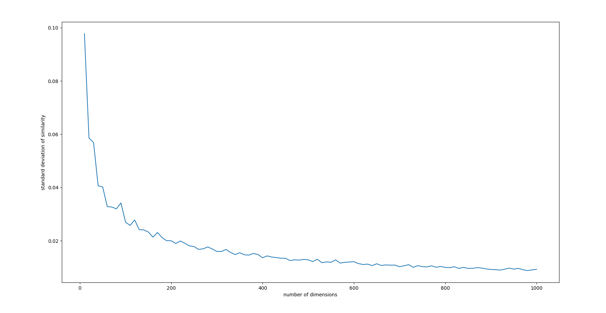

```{r, setup, include=FALSE}
knitr::opts_knit$set(root.dir = '../')

library(ggplot2)
library(ggthemes)
library(gridExtra)
```


\tableofcontents

# Cosine-based measures of bias

Modern Natural Language Processing (NLP) models are used to complete various tasks such as providing email filters, smart assistants, search results, language translations, text analytics and so on. All of them need as an input words represented by means of numbers which is accomplished with word embeddings. It seems that in the learning process these models can learn implicit biases that reflect harmful stereotypical thinking. One of the sources of bias in NLP can be located in the way the word embeddings are made. There is a considerable amount of literature available on the topic of bias detection and mitigation in NLP models. 


One of the first measures in the discussion has been developed by @bolukbasi2016man. There, the gender bias of a word $w$ is understood as its projection on the gender direction $\vec{w} \cdot (\overrightarrow{he} - \overrightarrow{she})$ (the gender direction is the top principal compontent of ten gender pair difference vectors). The underlying idea is that no bias is present if non-explicitly gendered words are in equal distance to both elements in all explicitly gender pairs. Given the (ideally) gender neutral words $N$ and the gender direction $g$ the direct gender bias is defined as the average distance of the words in $N$ from $g$ ($c$ is a parameter determining how strict we want to be):
\begin{align}
\mathsf{directBias_c(N,g)} & = \frac{\sum_{w\in N}\vert \mathsf{cos}(\vec{w},g)\vert^c}{\vert N \vert }
\end{align}

The use of projections has been ciriticized for instance by @Gonen2019lipstick, who point out that while gender-direction might be an indicator of bias, it is only one possible manifestation of it, and reducing a projection of words might be insufficient. For instance, "math" and "delicate" might be in equal distance to both explicitly gendered words while being closer to quite different stereotypical attribute words. Further, the authors point out that most word pairs preserve similarity under debiasing meant to minimize projection-based bias.^[@bolukbasi2016man use also another method which involves analogies and their evaluations by human users on Mechanical Turk. It is discussed and criticized in [@Nissim2020fair].]


To measure bias in word embeddings, @Caliskan2017semanticsBiases proposed the Word Embedding Association Test (WEAT). The idea is that the measure of  biases between two sets of target words, $X$ and $Y$, (we call them protected words) should be quantified in terms of the cosine similarity  between the protected words and attribute words coming from  two sets of stereotype attribute words, $A$ and $B$ (we'll call them attributes). For instance, $X$ might be a set of male names, $Y$ a set of female names, $A$ might contain stereotypically male-related career words, and $B$ stereotypically female-related family words. WEAT is a modification  of the Implicit Association Test (IAT) [@Nosek2002harvesting] used in psychology and uses almost the same word sets, allowing for a \emph{prima facie} sensible comparison with bias in humans. If the person's attitude towards given pair of concept is to be interpreted as neutral, there should be no noticeable task completion time difference, and the final value from the formula should be around 0.
Let $f$ be a similarity measure (usually, cosine similarity). The association difference for a term $t$ is:
\begin{align}
s(t,A,B) & = \frac{\sum_{a\in A}f(t,a)}{\vert A\vert} - \frac{\sum_{b\in B}f(t,b)}{\vert B\vert}
\end{align}
\noindent then, the association difference between $A$ a $B$ is:
\begin{align}
s(X,Y,A,B) & = \sum_{x\in X} s(x,A,B) -  \sum_{y\in Y} s(y,A,B)
\end{align}
\noindent
$s(X,Y,A,B)$ is the statistic used in the signifcance test, and the $p$-value obtained by bootstrapping: it is the frequency of $s(X_i,Y_i,A,B)>s(X,Y,A,B)$ for all equally sized partitions $X_i, Y_i$ of $X\cup Y$. The effect size is computed by normalizing the difference in means as follows:
\begin{align}
bias(A,B) & = \frac{
\mu(\{s(x,A,B)\}_{x\in X}) -\mu(\{s(y,A,B)\}_{y\in Y}) 
}{
\sigma(\{s(w,A,B)\}_{w\in X\cup Y})
}
\end{align}

@Caliskan2017semanticsBiases show that significant biases---thus measured--- similar to the ones discovered by IAT can be discovered in word embeddings. @Lauscher2019multidimensional extended the methodology to a multilingual and cross-lingual setting, arguing that using Euclidean distance instead of similarity does not make much difference, while the bias effects vary greatly across embedding models (interestingly, with social media-text trained embeddings being less biased than those based on Wikipedia).

A similar methodology is employed by @Garg2018years, who employ word embeddings trained on corpora from different decades to study the shifts in various biases. For instance, to compute the occupational embeddings bias for women the authors first compute the average vector of vector emeddings of words that represent women (e.g. "she", "female"), then calculate the Euclidean distance between this mean vector and words for occupations. Then they take the mean of these distances and subtract from it the analogously obtained mean for the average vector of vector embeddings of words that represent men. Formally they take the relative norm distance between $X$ and $Y$ to be:
\begin{align}
\textsf{relative norm distance} & = \sum_{v_m\in M} \vert \vert v_m - v_X\vert \vert_2 - \vert v_m - v_Y\vert \vert_2
\end{align}
\noindent where the norm used is Euclidean, and $v_X$ and $x_Y$ are average vectors for sets $X$ and $Y$ respectively. 


@Manzini2019blackToCriminal modify WEAT to a multi-class setting, introducing Mean Average Cosine similarity as a measure of bias (in fact, in the paper  they report distances rather than similarities). Let $T = \{t_1, \dots, t_k\}$ be a class of protected word embeddings, and let each $A_j\in A$ be a set of attributes stereotypically associated with a protected word). Then:
\begin{align}
S(t_i, A_j) & = \frac{1}{\vert A_j\vert}\sum_{a\in A_j}\mathsf{cos}(t,a) \\
MAC(T,A) & = \frac{1}{\vert T \vert \,\vert A\vert}\sum_{t_i \in T }\sum_{A_j \in A} S(t_i,A_j)
\end{align}
That is, for each protected word $T and each attribute class, they first take the mean for this protected word and all attributes in a given attribute class, and then take the mean of thus obtained means for all the protected words. The t-tests they employ are run on average cosines used to calculate MAC.


# Some methodological problems

\textbf{1. Selection of attributes}


Such approaches, however, are not unproblematic. For one thing, the word lists are often fairly small, and the papers do not discuss the impact of word list sizes on the uncertainty involved. 
 We will argue that the word list sizes are too small to yield strong conclusions, given the variances involved. 
 
 Crucially, these approaches use  means of mean average cosine similarities to measure  similarity between protected word and harmful stereotypes. If one takes  a closer look at the individual values that are taken for the calculations, it turns out that there are quite a few  outliers and surprisingly dissimilar words. This issue will become transparent when  we inspect  the visualizations of individual cosine distances, following the idea that one of the first step to understand data is to look at it.
 
 
 
 

\textbf{3. Hiding the impact of uncertainty}

With such a method the uncertainty involved is not really considered which makes it even more difficult to give reasonable interpretations of the results. We propose the use of Bayesian method to obtain some understanding of the influence the uncertainty has on the interpretation of final results. 


\textbf{4. No word class distinction and no control group}

In the original paper, words from all three religions were compared against all of the stereotypes, which means that there was no distinction between cases in which the stereotype is associated with a given religion, as opposed to the situation in which it is associated with another one. Not all of the stereotypical words have to be considered as harmful for all of the religions. One should investigate the religions separately as some of them may have stronger harmful associations that others. One should also include control groups to have a way of comparing the stereotypical results with neutral or human-like words. Later in the text we will explain in details reasons for introducing control groups. In our analysis, we distinguish between stereotypes associated with a given group, stereotypes associated with different groups, and control groups: neutral words and stereotypes-free human predicates.

\textbf{5. Interpreting the results}

Assuming for a moment that the value of multi-class cosine distance is correct, one may question the interpretation. @Manzini2019blackToCriminal summarize the averages of cosine distance per group (gender, race, religion). For now let us focus now on analyzing the values relating to religious biases. Here is the relevant fragment of table:


Religion Debiasing  | MAC
------------- | -------------
Biased        | 0.859
Hard Debiased | 0.934
Soft Debiased ($\lambda$ = 0.2) | 0.894


MAC stand for mean average cosine similarity, although in reality the the table contains mean distances. What may attract attention is the fact that the value of cosine distance in "Biased" category is already quite high even before debiasing. High cosine distance indicates low cosine similarity between values. One could think that average cosine similarity equal to approximately 0.141 is not significant enough to consider it as bias. However the authors aim to mitigate "biases" in vectors with such great distance to make it even larger. Methodologically the question is, on what basis is this small similarity still considered as a proof of the presence of bias, and whether these small changes are meaningful. This is in general the problem of scale and the lack of universal intervals. In contrast, statistical intervals will help us decide whether a given cosine similarity is high enough to consider the words to be more similar than if we chose them at random. We will use highest posterior density intervals, in line with Bayesian methodology. 

\textbf{6. The curse of dimensionality}

In our case, the curse of dimensionality may take place when there is an increase in the volume of data that results in adding extra dimensions to the Euclidean space. According to the article 
[Curse of dimensionality at analyticsindiamag.com](https://analyticsindiamag.com/curse-of-dimensionality-and-what-beginners-should-do-to-overcome-it/) as the number of features increases, it may be harder and harder to obtain useful information from the data using the available algorithms. One may notice that more data should contribute to greater amount of information, but more information also means greater risk of noise and distractions in data. At the same time, modern solutions are often adapted to smaller dimensions and their results in higher ones are not intuitive, or may be prone to error. 

Using cosine similarity in high dimensions in word embeddings may also be prone to the curse of dimensionality. According to @Venkat2018Curse there are reasons to consider this phenomenon when searching for word similarities in higher dimensions. An experiment is conducted that aims at showing how the similarity values and variation change as the number of dimensions increases. The hypothesis made in the paper states that two things will happen as the number of dimensions increase. First, the effort required to measure cosine similarity will be greater, and two, the similarity between data will blur out and have less variation. The authors generate random points with increasing number of dimensions where each dimension of a data point is given a value between 0 and 1. Then they pick one vector at random from each dimension class and calculate the cosine similarity between the chosen vector and the rest of the data. Then they check how the variation of values changes as the number of dimensions increases. It seems like the more dimensions there are, the smaller the variance and therefore it is less obvious how to interpret the resulting cosine similarities. Maybe the scale should be adjusted to the number of dimensions and variance so that it still gives us sensible information about data. Yet, according to some articles cosine similarity in high dimensions is not reliable enough as it may be the case that choosing words at random may result in similar values as when picking them consciously. 




# The problem with means of means


The measures described all calculate means of means and their authors run statistical tests on sets of means. This, however, is problematic for two related reasons. One, by pre-averaging data we throw away information about sample sizes. For the former point, think about proportions: 10 out of 20 and 2 out of 4 give the same mean, but you would obtain more information by making the former observation rather than by making the latter.  Two, when we pre-average, we remove variation, and so pre-averaging  tend to manufacture false confidence. We will have more to say about whether this happens in the case of applications of MAC, for now let's go over a simple example to make the conceptual point clear.

To illustrate let's employ the formulas used by @Caliskan2017semanticsBiases in a simple example. Conceptually, all such tests come up with rather short lists of protected words and rather short lists of stereotypical attributes. Clearly, these are not complete list. So let's treat them as  samples from richer pools of stereotypical predicates and let's take the uncertainty and variation involved seriously. 

Consider a simple situation in which there are two protected classes, $X=\{t_1,t_2\}$ and $Y=\{t_3,t_4\}$ and two five-element attribute sets $A$ and $B$. 

First, we play around with a scenario in which all the protected terms are on average equally unsimilar to both sets ($\mu =0$) with standard deviation of $.05$. Let's randomly draw similarity scores and plot the results with group means plotted as vertical lines.

\footnotesize
```{r,echo=TRUE,eval=TRUE,fig.align = "center",cache=TRUE, fig.show = "hold", out.width = "100%"}
set.seed(123)
t1 <- data.frame(A  = rnorm(5,0,0.05), B = rnorm(5,0,0.05))
t2 <- data.frame(A  = rnorm(5,0,0.05), B = rnorm(5,0,0.05))
t3 <- data.frame(A  = rnorm(5,0,0.05), B = rnorm(5,0,0.05))
t4 <- data.frame(A  = rnorm(5,0,0.05), B = rnorm(5,0,0.05))
```
\normalsize


```{r,echo=FALSE,eval=TRUE,fig.align = "center",cache=TRUE, fig.show = "hold", out.width = "100%"}
xlimits <- c(-.3,.3)

t1Plot <- ggplot(t1)+geom_point(aes(y = 0, x = A), size = 1, alpha = 0.5)+geom_point(aes(y = 0.1, x = B), col = "skyblue", size = 1, alpha = 0.5)+theme_tufte()+xlab("similarity")+scale_y_continuous(limits = c(-.05,.15),breaks = c(0,0.1), labels = c("A","B"))+ylab("group") + geom_vline(aes(xintercept = mean(A)), size = 0.3) + geom_vline(aes(xintercept = mean(B)), size = 0.3, col = "skyblue") +ggtitle("Similarities for term t1 in X")+xlim(xlimits)


t2Plot <- ggplot(t2)+geom_point(aes(y = 0, x = A), size = 1, alpha = 0.5)+geom_point(aes(y = 0.1, x = B), col = "skyblue", size = 1, alpha = 0.5)+theme_tufte()+xlab("similarity")+scale_y_continuous(limits = c(-.05,.15),breaks = c(0,0.1), labels = c("A","B"))+ylab("group") + geom_vline(aes(xintercept = mean(A)), size = 0.3) + geom_vline(aes(xintercept = mean(B)), size = 0.3, col = "skyblue") +ggtitle("Similarities for term t2 in X")+xlim(xlimits)

t3Plot <- ggplot(t3)+geom_point(aes(y = 0, x = A), size = 1, alpha = 0.5)+geom_point(aes(y = 0.1, x = B), col = "skyblue", size = 1, alpha = 0.5)+theme_tufte()+xlab("similarity")+scale_y_continuous(limits = c(-.05,.15),breaks = c(0,0.1), labels = c("A","B"))+ylab("group") + geom_vline(aes(xintercept = mean(A)), size = 0.3) + geom_vline(aes(xintercept = mean(B)), size = 0.3, col = "skyblue") +ggtitle("Similarities for term t3 in Y")+xlim(xlimits)

t4Plot <- ggplot(t4)+geom_point(aes(y = 0, x = A), size = 1, alpha = 0.5)+geom_point(aes(y = 0.1, x = B), col = "skyblue", size = 1, alpha = 0.5)+theme_tufte()+xlab("similarity")+scale_y_continuous(limits = c(-.05,.15),breaks = c(0,0.1), labels = c("A","B"))+ylab("group") + geom_vline(aes(xintercept = mean(A)), size = 0.3) + geom_vline(aes(xintercept = mean(B)), size = 0.3, col = "skyblue") +ggtitle("Similarities for term t4 in Y")+xlim(xlimits)

grid.arrange(t1Plot,t2Plot, t3Plot, t4Plot, ncol=2)
```


\noindent When you look at the datapoints, do you have the impression of a strong bias here? We wouldn't think so.  But now let's run the calculations from [@Caliskan2017semanticsBiases].

\vspace{1mm}
\footnotesize
```{r,echo=TRUE,eval=TRUE,fig.align = "center",cache=TRUE, fig.show = "hold", out.width = "100%"}
s <- function (table){ mean(table$A) - mean(table$B)}
factor <- sd(c(s(t1),s(t2),s(t3),s(t4)))
numerator <-  mean(s(t1),s(t2)) - mean(s(t3),s(t4))
print(list(factor = factor,numerator = numerator, bias = numerator / factor))
```
\normalsize

\noindent This should make us pause. We know these were points randomly drawn from distributions where there is no difference in means. Yet, the calculated effect size is 1.82, whereas the largest effect size reported by @Caliskan2017semanticsBiases is 1.81! 

Interestingly, if we repeat the drawing 10000 times, each time calculating the  bias, it turns out that with this variance and sample size, pretty much anything can happen. 

\vspace{1mm}
\footnotesize
```{r,echo=TRUE,eval=TRUE,fig.align = "center",cache=TRUE, fig.show = "hold", out.width = "100%"}

biasesNull <- numeric(10000)
for(i in 1:10000){
t1 <- data.frame(A  = rnorm(5,0,0.05), B = rnorm(5,0,0.05))
t2 <- data.frame(A  = rnorm(5,0,0.05), B = rnorm(5,0,0.05))
t3 <- data.frame(A  = rnorm(5,0,0.05), B = rnorm(5,0,0.05))
t4 <- data.frame(A  = rnorm(5,0,0.05), B = rnorm(5,0,0.05))

factor <- sd(c(s(t1),s(t2),s(t3),s(t4)))
numerator <-  mean(s(t1),s(t2)) - mean(s(t3),s(t4))
biasesNull[i]  <- numerator / factor
}
ggplot()+geom_histogram(aes(x=biasesNull, y = ..density..), alpha = 0.6, bins=50)+
  theme_tufte()+labs(title="10k biases for identical means and sd =.05")+ xlab("bias")
```
\normalsize


Now, let's simulate a situation where the means are identical but the standard deviation is much smaller, .001. 


\footnotesize
```{r,echo=TRUE,eval=TRUE,fig.align = "center",cache=TRUE, fig.show = "hold", out.width = "100%"}
set.seed(124)
t1v <- data.frame(A  = rnorm(5,0,0.001), B = rnorm(5,0,0.001))
t2v <- data.frame(A  = rnorm(5,0,0.001), B = rnorm(5,0,0.001))
t3v <- data.frame(A  = rnorm(5,0,0.001), B = rnorm(5,0,0.001))
t4v <- data.frame(A  = rnorm(5,0,0.001), B = rnorm(5,0,0.001))
```
\normalsize


```{r,echo=FALSE,eval=TRUE,fig.align = "center",cache=TRUE, fig.show = "hold", out.width = "100%"}
xlimits <- c(-.3,.3)


t1vPlot <- ggplot(t1v)+geom_point(aes(y = 0, x = A), size = 1, alpha = 0.5)+geom_point(aes(y = 0.1, x = B), col = "skyblue", size = 1, alpha = 0.5)+theme_tufte()+xlab("similarity")+scale_y_continuous(limits = c(-.05,.15),breaks = c(0,0.1), labels = c("A","B"))+ylab("group") + geom_vline(aes(xintercept = mean(A)), size = 0.3) + geom_vline(aes(xintercept = mean(B)), size = 0.3, col = "skyblue") +ggtitle("Similarities for term t1 in X")+xlim(xlimits)


t2vPlot <- ggplot(t2v)+geom_point(aes(y = 0, x = A), size = 1, alpha = 0.5)+geom_point(aes(y = 0.1, x = B), col = "skyblue", size = 1, alpha = 0.5)+theme_tufte()+xlab("similarity")+scale_y_continuous(limits = c(-.05,.15),breaks = c(0,0.1), labels = c("A","B"))+ylab("group") + geom_vline(aes(xintercept = mean(A)), size = 0.3) + geom_vline(aes(xintercept = mean(B)), size = 0.3, col = "skyblue") +ggtitle("Similarities for term t2 in X")+xlim(xlimits)

t3vPlot <- ggplot(t3v)+geom_point(aes(y = 0, x = A), size = 1, alpha = 0.5)+geom_point(aes(y = 0.1, x = B), col = "skyblue", size = 1, alpha = 0.5)+theme_tufte()+xlab("similarity")+scale_y_continuous(limits = c(-.05,.15),breaks = c(0,0.1), labels = c("A","B"))+ylab("group") + geom_vline(aes(xintercept = mean(A)), size = 0.3) + geom_vline(aes(xintercept = mean(B)), size = 0.3, col = "skyblue") +ggtitle("Similarities for term t3 in Y")+xlim(xlimits)

t4vPlot <- ggplot(t4v)+geom_point(aes(y = 0, x = A), size = 1, alpha = 0.5)+geom_point(aes(y = 0.1, x = B), col = "skyblue", size = 1, alpha = 0.5)+theme_tufte()+xlab("similarity")+scale_y_continuous(limits = c(-.05,.15),breaks = c(0,0.1), labels = c("A","B"))+ylab("group") + geom_vline(aes(xintercept = mean(A)), size = 0.3) + geom_vline(aes(xintercept = mean(B)), size = 0.3, col = "skyblue") +ggtitle("Similarities for term t4 in Y")+xlim(xlimits)

grid.arrange(t1vPlot,t2vPlot, t3vPlot, t4vPlot, ncol=2)
```


\noindent When you look at the datapoints, do you have the impression of a strong bias here? We wouldn't think so.  But now let's run the calculations from [@Caliskan2017semanticsBiases].

\vspace{1mm}
\footnotesize
```{r,echo=TRUE,eval=TRUE,fig.align = "center",cache=TRUE, fig.show = "hold", out.width = "100%"}
factorV <- sd(c(s(t1v),s(t2v),s(t3v),s(t4v)))
numeratorV <-  mean(s(t1v),s(t2v)) - mean(s(t3v),s(t4v))
print(list(factor = factorV,numerator = numeratorV, bias = numeratorV / factorV))
```
\normalsize


While the numerator and the factors changed a lot, the bias actually increased. One reason bias increases is that once the standard deviation goes down, so does the factor used in the calculation of bias. 


Again, to see whether this metric would provide us with meaningful information, let's simulate 10000 drawings.


\vspace{1mm}
\footnotesize
```{r,echo=TRUE,eval=TRUE,fig.align = "center",cache=TRUE, fig.show = "hold", out.width = "100%"}
set.seed(124)

biasesLowVariance <- numeric(10000)
for(i in 1:10000){
t1v <- data.frame(A  = rnorm(5,0,0.001), B = rnorm(5,0,0.001))
t2v <- data.frame(A  = rnorm(5,0,0.001), B = rnorm(5,0,0.001))
t3v <- data.frame(A  = rnorm(5,0,0.001), B = rnorm(5,0,0.001))
t4v <- data.frame(A  = rnorm(5,0,0.001), B = rnorm(5,0,0.001))

factorV <- sd(c(s(t1v),s(t2v),s(t3v),s(t4v)))

numeratorV <-  mean(s(t1v),s(t2v)) - mean(s(t3v),s(t4v))

biasesLowVariance[i] <- numeratorV / factorV
}
ggplot()+geom_histogram(aes(x=biasesLowVariance, y = ..density..), alpha = 0.6, bins=50)+
  theme_tufte()+labs(title="10k biases for identical means and sd =.001")+ xlab("bias")
```
\normalsize

Again, not so informative. Now, let's try sampling from distributions where there in fact is a difference in means. Terms from $X$ are on average .1 similar to $A$ (and still $0$ to $B$), while terms from $Y$ are $.1$ similar to $B$ (and 0 to $A$). The standard deviation is 0.05 in all the cases. There is a  clear difference between $X$ and $Y$ and quick visual inspection should tell us so.


\vspace{1mm}
\footnotesize
```{r,echo=TRUE,eval=TRUE,fig.align = "center",cache=FALSE, fig.show = "hold", out.width = "100%"}
set.seed(766)
t1d2 <- data.frame(A  = rnorm(5,.1,0.05), B = rnorm(5,0,0.05))
t2d2 <- data.frame(A  = rnorm(5,.1,0.05), B = rnorm(5,0,0.05))
t3d2 <- data.frame(A  = rnorm(5,0,0.05), B = rnorm(5,.1,0.05))
t4d2 <- data.frame(A  = rnorm(5,0,0.05), B = rnorm(5,.1,0.05))
```
\normalsize


\vspace{1mm}
\footnotesize
```{r,echo=FALSE,eval=TRUE,fig.align = "center",cache=TRUE, fig.show = "hold", out.width = "100%"}
library(grid)
library(gridExtra)
t1d2Plot <- ggplot(t1d2)+geom_point(aes(y = 0, x = A), size = 1, alpha = 0.5)+geom_point(aes(y = 0.1, x = B), col = "skyblue", size = 1, alpha = 0.5)+theme_tufte()+xlab("similarity")+scale_y_continuous(limits = c(-.05,.15),breaks = c(0,0.1), labels = c("A","B"))+ylab("group") + geom_vline(aes(xintercept = mean(A)), size = 0.3) + geom_vline(aes(xintercept = mean(B)), size = 0.3, col = "skyblue") +ggtitle("Similarities for term t1 in X")+xlim(xlimits)

t2d2Plot <- ggplot(t2d2)+geom_point(aes(y = 0, x = A), size = 1, alpha = 0.5)+geom_point(aes(y = 0.1, x = B), col = "skyblue", size = 1, alpha = 0.5)+theme_tufte()+xlab("similarity")+scale_y_continuous(limits = c(-.05,.15),breaks = c(0,0.1), labels = c("A","B"))+ylab("group") + geom_vline(aes(xintercept = mean(A)), size = 0.3) + geom_vline(aes(xintercept = mean(B)), size = 0.3, col = "skyblue") +ggtitle("Similarities for term t2 in X")+xlim(xlimits)

t3d2Plot <- ggplot(t3d2)+geom_point(aes(y = 0, x = A), size = 1, alpha = 0.5)+geom_point(aes(y = 0.1, x = B), col = "skyblue", size = 1, alpha = 0.5)+theme_tufte()+xlab("similarity")+scale_y_continuous(limits = c(-.05,.15),breaks = c(0,0.1), labels = c("A","B"))+ylab("group") + geom_vline(aes(xintercept = mean(A)), size = 0.3) + geom_vline(aes(xintercept = mean(B)), size = 0.3, col = "skyblue") +ggtitle("Similarities for term t3 in Y")+xlim(xlimits)

t4d2Plot <- ggplot(t4d2)+geom_point(aes(y = 0, x = A), size = 1, alpha = 0.5)+geom_point(aes(y = 0.1, x = B), col = "skyblue", size = 1, alpha = 0.5)+theme_tufte()+xlab("similarity")+scale_y_continuous(limits = c(-.05,.15),breaks = c(0,0.1), labels = c("A","B"))+ylab("group") + geom_vline(aes(xintercept = mean(A)), size = 0.3) + geom_vline(aes(xintercept = mean(B)), size = 0.3, col = "skyblue") +ggtitle("Similarities for term t4 in Y")+xlim(xlimits)

grid.arrange(t1d2Plot,t2d2Plot, t3d2Plot, t4d2Plot, ncol=2,   
      top = textGrob("different means, sd=0.05",gp=gpar(fontsize=15,font=1)))
```
\normalsize

\noindent  Is this clear difference mirrored in the calculations?

\footnotesize
```{r,echo=TRUE,eval=TRUE,fig.align = "center",cache=FALSE, fig.show = "hold", out.width = "100%"}
factorD2 <- sd(c(s(t1d2),s(t2d2),s(t3d2),s(t4d2)))
numeratorD2 <-  mean(s(t1d2),s(t2d2)) - mean(s(t3d2),s(t4d2))
biasD2 <- numeratorD2 / factorD2
biasD2
```
\normalsize 

\noindent The absolute value of the effect size is smaller than in the null case with the same standard deviation.  Let's simulate 10000 drawings:

\vspace{1mm}
\footnotesize
```{r,echo=TRUE,eval=TRUE,fig.align = "center",cache=TRUE, fig.show = "hold", out.width = "100%"}
biasesD2 <- numeric(10000)
for(i in 1:10000){
t1d2 <- data.frame(A  = rnorm(5,.1,0.05), B = rnorm(5,0,0.05))
t2d2 <- data.frame(A  = rnorm(5,.1,0.05), B = rnorm(5,0,0.05))
t3d2 <- data.frame(A  = rnorm(5,0,0.05), B = rnorm(5,.1,0.05))
t4d2 <- data.frame(A  = rnorm(5,0,0.05), B = rnorm(5,.1,0.05))

factorD2 <- sd(c(s(t1d2),s(t2d2),s(t3d2),s(t4d2)))
numeratorD2 <-  mean(s(t1d2),s(t2d2)) - mean(s(t3d2),s(t4d2))
biasesD2[i] <- numeratorD2/factorD2
}

ggplot()+geom_histogram(aes(x=biasesD2, y = ..density..), alpha = 0.6, bins=50)+
  theme_tufte()+labs(title="10k biases for different means and sd =.05")+ xlab("bias")
```
\normalsize


\noindent Now suppose we keep the means the same but increase the standard deviation to .1.


\vspace{1mm}
\footnotesize
```{r,echo=TRUE,eval=TRUE,fig.align = "center",cache=FALSE, fig.show = "hold", out.width = "100%"}
set.seed(766)
t1d1 <- data.frame(A  = rnorm(5,.1,0.1), B = rnorm(5,0,0.1))
t2d1 <- data.frame(A  = rnorm(5,.1,0.1), B = rnorm(5,0,0.1))
t3d1 <- data.frame(A  = rnorm(5,0,0.1), B = rnorm(5,.1,0.1))
t4d1 <- data.frame(A  = rnorm(5,0,0.1), B = rnorm(5,.1,0.1))
```
\normalsize

\vspace{1mm}
\footnotesize
```{r,echo=FALSE,eval=TRUE,fig.align = "center",cache=TRUE, fig.show = "hold", out.width = "100%"}
t1d1Plot <- ggplot(t1d1)+geom_point(aes(y = 0, x = A), size = 1, alpha = 0.5)+geom_point(aes(y = 0.1, x = B), col = "skyblue", size = 1, alpha = 0.5)+theme_tufte()+xlab("similarity")+scale_y_continuous(limits = c(-.05,.15),breaks = c(0,0.1), labels = c("A","B"))+ylab("group") + geom_vline(aes(xintercept = mean(A)), size = 0.3) + geom_vline(aes(xintercept = mean(B)), size = 0.3, col = "skyblue") +ggtitle("Similarities for term t1 in X")+xlim(xlimits)

t2d1Plot <- ggplot(t2d1)+geom_point(aes(y = 0, x = A), size = 1, alpha = 0.5)+geom_point(aes(y = 0.1, x = B), col = "skyblue", size = 1, alpha = 0.5)+theme_tufte()+xlab("similarity")+scale_y_continuous(limits = c(-.05,.15),breaks = c(0,0.1), labels = c("A","B"))+ylab("group") + geom_vline(aes(xintercept = mean(A)), size = 0.3) + geom_vline(aes(xintercept = mean(B)), size = 0.3, col = "skyblue") +ggtitle("Similarities for term t2 in X")+xlim(xlimits)

t3d1Plot <- ggplot(t3d1)+geom_point(aes(y = 0, x = A), size = 1, alpha = 0.5)+geom_point(aes(y = 0.1, x = B), col = "skyblue", size = 1, alpha = 0.5)+theme_tufte()+xlab("similarity")+scale_y_continuous(limits = c(-.05,.15),breaks = c(0,0.1), labels = c("A","B"))+ylab("group") + geom_vline(aes(xintercept = mean(A)), size = 0.3) + geom_vline(aes(xintercept = mean(B)), size = 0.3, col = "skyblue") +ggtitle("Similarities for term t3 in Y")+xlim(xlimits)

t4d1Plot <- ggplot(t4d1)+geom_point(aes(y = 0, x = A), size = 1, alpha = 0.5)+geom_point(aes(y = 0.1, x = B), col = "skyblue", size = 1, alpha = 0.5)+theme_tufte()+xlab("similarity")+scale_y_continuous(limits = c(-.05,.15),breaks = c(0,0.1), labels = c("A","B"))+ylab("group") + geom_vline(aes(xintercept = mean(A)), size = 0.3) + geom_vline(aes(xintercept = mean(B)), size = 0.3, col = "skyblue") +ggtitle("Similarities for term t4 in Y")+xlim(xlimits)

grid.arrange(t1d1Plot,t2d1Plot, t3d1Plot, t4d1Plot, ncol=2)
```
\normalsize

\noindent  Is this clear difference mirrored in the calculations?

\footnotesize
```{r,echo=TRUE,eval=TRUE,fig.align = "center",cache=FALSE, fig.show = "hold", out.width = "100%"}
factorD1 <- sd(c(s(t1d1),s(t2d1),s(t3d1),s(t4d1)))
numeratorD1 <-  mean(s(t1d1),s(t2d1)) - mean(s(t3d1),s(t4d1))
biasD1 <- numeratorD1 / factorD1
biasD1
```
\normalsize 

\noindent The absolute value of the effect size is smaller than in the previous case! 


\vspace{1mm}
\footnotesize
```{r,echo=TRUE,eval=TRUE,fig.align = "center",cache=TRUE, fig.show = "hold", out.width = "100%"}
biasesD1 <- numeric(10000)

for(i in 1:10000){
t1d1 <- data.frame(A  = rnorm(5,.1,0.1), B = rnorm(5,0,0.1))
t2d1 <- data.frame(A  = rnorm(5,.1,0.1), B = rnorm(5,0,0.1))
t3d1 <- data.frame(A  = rnorm(5,0,0.1), B = rnorm(5,.1,0.1))
t4d1 <- data.frame(A  = rnorm(5,0,0.1), B = rnorm(5,.1,0.1))

factorD1 <- sd(c(s(t1d1),s(t2d1),s(t3d1),s(t4d1)))
numeratorD1 <-  mean(s(t1d1),s(t2d1)) - mean(s(t3d1),s(t4d1))
biasesD1[i] <- numeratorD1/factorD1
}

ggplot()+geom_histogram(aes(x=biasesD1, y = ..density..), alpha = 0.6, bins=50)+
  theme_tufte()+labs(title="10k biases for different means and sd =.001")+ xlab("bias")
```
\normalsize

This is is a bit better, but still quite some uncertainty is involved, far from what systematically low mean-based p-values reported in the papers might suggest.  Of course, this is a bit of a caricature, as our word lists were short (four protected words and 10 attributes). But the word lists used in the actually papers are not much longer.  In such a set-up the key observations are as follows:

- Seemingly high bias measures might arise even if the underlying processes actually have the same mean.

- Even if the mean remains the same, non-negligible changes can result from a shift in the standard deviation of the original process, and the change might go in the opposite direction than a visualisation of datapoints might suggest, because with the decrease of standard deviation, the factor decreases and the bias increases. 


- Even if the underlying means are the same, but the variation is different, the bias metric in the long run could tend toward a different value:

- The lack of control group in the paper and our analysis indicates that without neutral baseline it is difficult
to interpret the effectiveness of the metric. 

\vspace{1mm}
\footnotesize
```{r,echo=TRUE,eval=TRUE,fig.align = "center",cache=TRUE, fig.show = "hold", out.width = "100%"}
mean(biasesD1); mean(biasesD2)
median(biasesD1); median(biasesD2)
```

\normalsize
and so the point estimations of bias are sensitive to factors other than the underlying process means.


- Even if there is a difference in means, the bias metric can be lower, and the uncertainty about it needs to be gauged. 

- The uncertainty resulting from including the raw datapoint variance into considerations is more extensive than the one suggested by the low p-values obtained from taking means as datapoints. 

\vspace{1mm}
\footnotesize
```{r,echo=TRUE,eval=TRUE,fig.align = "center",cache=TRUE, fig.show = "hold", out.width = "100%"}
quantile(biasesD2, probs = c(0.275,0.975))
quantile(biasesD1, probs = c(0.275,0.975))
```
\normalsize

# Bayesian estimation 

We noticed that in @Manzini2019blackToCriminal words from all three sub-classes (in the case of religion by sub-class we mean Christianity, Judaism, Islam) were compared against all of the stereotypes, which means that there was no distinction between cases in which the stereotype is associated with a given sub-class, as opposed to the situation in which it is associated with another one. Not all of the stereotypical words have to be considered as harmful for all of the sub-groups. One should investigate the sub-groups separately as some of them may have stronger harmful associations than others. 


We decided to add control groups in the form of two classes — neutral words and human-related words. Without a proper control group it is quite hard to compare the resulting cosine distances and decide on their significance in bias detection. We prepared approximately 230 neutral words to double-check the prima-facie neutral hypothesis that their cosine similarity to the protected words will oscillate around 0 (that is, the distances will be around 1). This provides us with a more reliable point of reference. Moreover,
we added human attributes that are associated with people in general to investigate whether the smaller cosine distance between protected words and stereotypes can result simply from the fact that the stereotype predicates are associated with humans.


One may consider improving the bias detection method presented in @Manzini2019blackToCriminal. As the chosen protected words and attributes do not represent the whole biased population but only a sample, it is justified to introduce the uncertainty measure to the method. We decided to use Bayesian estimation to make the cosine distance method more methodologically correct.


Our priors distributions for the Bayesian model reflect our knowledge about the data. The distribution for mean distance (cosine distance) is set to be between 0 and 2 with the mean equal to 1. We assume that most of the cosine distances may be considered neutral and therefore their similarity will be small. The distribution for prior for standard deviation is mostly between 0 and 1 with mean around 0. Finally the distribution for prior for coefficients is mostly between -1 and 1, with mean around 0. One should remember that the cosine distance values have range between 0 and 2 therefore the choice of the prior distributions should reflect this constraint. As we want to verify as objectively as possible the assumptions present in @Manzini2019blackToCriminal we decided to use fairly weak and slightly skeptical regularizing priors. The models parameters will have a posterior distribution obtained using either Hamiltionian Monte Carlo methods (STAN) available through the rethinking package. 


\begin{center}
\begin{figure}[!htb]\centering
   \begin{minipage}{0.55\textwidth}
  \includegraphics[width=7cm]{../images/religionCoeffs.jpeg}
   \end{minipage}
   \begin {minipage}{0.43\textwidth}
    \includegraphics[width=7cm]{../images/religionGoogleCoeffs.jpeg}
   \end{minipage}
   
   
  \begin{minipage}{0.55\textwidth}
\includegraphics[width=7cm]{../images/genderCoeffs.jpeg}
\end{minipage}
   \begin {minipage}{0.43\textwidth}
    \includegraphics[width=7cm]{../images/genderGoogleCoeffs.jpeg}
   \end{minipage}
   
   
   
   
  \begin{minipage}{0.55\textwidth}
\includegraphics[width=7cm]{../images/raceCoeffs.jpeg}
\end{minipage}
   \begin {minipage}{0.43\textwidth}
    \includegraphics[width=7cm]{../images/raceGoogleCoeffs.jpeg}
   \end{minipage}
\end{figure}


\end{center}


Let's analyse dataset-level coefficients together with their highest posterior density intervals, for the three topic groups. We compare the results for two different word emebeddings corpuses - RedditL2 and GoogleNews. For Google embeddings the HPDIs
for all class coefficients (associated, different, human, and none) include zero. This can lead one to a conclusion that the impact for associated, different, human and neutral attribute is, when averaged, quite similar. This indicates how including the uncertainty
may change the use and interpretation of Manzini, Lim, Tsvetkov, & Black (2019) MAC metric. It seems that if one focuses only on differences between means of means, this is too simplistic.


In the case of Reddit word embeddings the situation is similar although HPDI is below 0 for Gender class when looking at `associated` and `different` mean coefficient. This can suggest that there is indeed slightly stronger impact of these attributes. One should also notice how in general associated and different coefficients have quite similar HPDI range, the highest observed absolute difference is equal to only 0.1. This suggests that again the impact of associated attributes and different ones is not clear at first sight. Finally, let’s compare the HPDIs for Reddit and Reddit debiased datasets. For Religion and Race dataset there is a minor shift (in absolute values the highest change is equal to approximately 0.1) of the mean coefficients towards zero. However for Gender dataset there is no significant change. This is of course a general look at the group coefficients. Let’s now analyze the individual words.


Looking at Reddit individual words one can observe that for Religion the cosine distance results for the associated attributes are for most of the words close to human attributes as well. This can suggest that in some cases words concerning humans can have higher
similarity with some protected words independently of whether they are stereotypical or neutral-human words. One should also pay attention to the fact that for all of the associated and different attributes in Religion, the uncertainty intervals overlap at
some point. What is even more surprising is that for protected words, such as “torah” the associated attribute has the the cosine distance slightly over 1, which means no positive similarity! If the protected words that we chose do not have high similarity
with harmful associated attributes, then one should consider at least three scenarios. The first one is that the choice of the protected words and attributes may be corrupted. The second one is that the metric is unable to catch the hidden bias properly. The third one is that there is actually no bias between the words. Regardless of which scenario one considers, it is essential to take a look at the individual values before averaging them or aggregating in other ways. It seems that using Bayesian method can enhance
the process of verifying the hypotheses concerning the choice of protected words and attributes.


Surprisingly in Gender one can observe high cosine similarity values between some female stereotypical professions and male protected words. If a word stereotypically associated with females has low cosine distance to male protected words, then one should investigate the issue further. The reasons for this unexpected cosine distance may lie in the frequency of appearance of the protected words in the raw data. Some of the groups (like Muslim people or females) may have less representation in the data that is taken as an input for word embeddings. Therefore, if we assume that the MAC detects actually co-occurrence only, it makes sense that they can have high similarity with associated attributes and lower similarity with different ones. At the same time male protected words and other religions can have high similarity with different attributes because they have greater representation in the dataset in general and occur close to much more concepts. Cosine distance seems to capture the information on the co-occurrence of words and not on the semantic similarity strictly speaking.


In Google, one may notice interesting phenomena as well. Although the GoogleNews dataset is larger, trained on different data sources and with the use of more dimensions, some of the results are similar to the ones obtained for the Reddit corpus. For Religion
almost all of the values for associated class intersect with different class as well. In the case of Race it is 100% of the available words. This indicates again that it is not clear how the metric should be used. Quite a different situation takes place for
Gender, where the similarity between associated and different is present mostly for the male protected words. This means that male words have high similarity with both male stereotypical professions and female ones. However, for females, the similarity is
high mostly only for the female stereotypical professions. This observation could not be made when using MAC metric only, as it requires investigating the individual words, and providing uncertainty.


# Effects of debiasing

One may verify if the dataset-level coefficients changed after the debiasing method used in @Manzini2019blackToCriminal. 
In some cases there is a minor change to the right, the mean value is closer to 0. The `associated` and `differen` attributes are now more overlapping than before. However, the uncertainty intervals are still high and therefore the significance of the change cannot be considered as enormous. The surprising obervation is that in the case of `Gender` and `Race` groups, the neutral words shifted to the left, further from the neutral position.  

\begin{center}
\begin{figure}[!htb]\centering
   \begin{minipage}{0.55\textwidth}
  \includegraphics[width=7cm]{../images/religionCoeffs.jpeg}
   \end{minipage}
   \begin {minipage}{0.43\textwidth}
    \includegraphics[width=7cm]{../images/debiasedReligionRedditCoeffs.jpeg}
   \end{minipage}
   
   
  \begin{minipage}{0.55\textwidth}
\includegraphics[width=7cm]{../images/genderCoeffs.jpeg}
\end{minipage}
   \begin {minipage}{0.43\textwidth}
    \includegraphics[width=7cm]{../images/debiasedGenderRedditCoeffs.jpeg}
   \end{minipage}
   
   
   
   
  \begin{minipage}{0.55\textwidth}
\includegraphics[width=7cm]{../images/raceCoeffs.jpeg}
\end{minipage}
   \begin {minipage}{0.43\textwidth}
    \includegraphics[width=7cm]{../images/debiasedRaceRedditCoeffs.jpeg}
   \end{minipage}
\end{figure}

\end{center}


When analyzing the Reddit debiased results one should investigate the change of the individual cosine distance values as well. It seems that not all of the protected words are treated equally when performing debiasing. In religion, the values for associated class moved towards 0 for most of the words except for the ones for Islam, where still the associated class has quite lower cosine distance than the different one. Similar situation takes place in Gender, where female words have still much lower cosine distance values for
associated class than for the different one. In the case of male protected words it is mostly almost the same interval for associated and different. As the Gender data is quite specific as the attributes are not harmful adjectives but (in an ideal world)
neutral professions, the aim (if we follow MAC assumptions) should actually be to make the cosine distance same for both female and male protected words. However, as we pointed out the situation after debiasing can sometimes be better only for one protected
group, which is not the desired outcome. In the case of Religion, even after debiasing, all of the protected words have intersections between associated and different class and similarity greater than 0. As all of the attributes in religion data are negative
and harmful stereotypes, one should not aim at making the distance between protected words and associated, and different class the same but rather to move it towards 1.

# Discussion 


\newpage

\noindent \huge  \textbf{Appendix} \normalsize

\noindent \Large \textbf{Word lists, including human and neutral predicates} \normalsize


#  References {-}

\vspace{-3mm}


